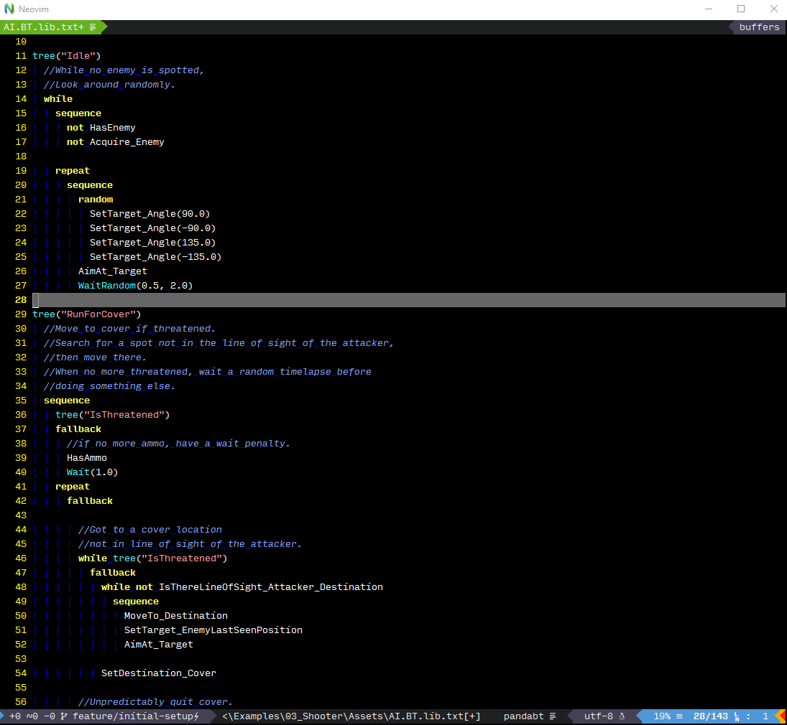
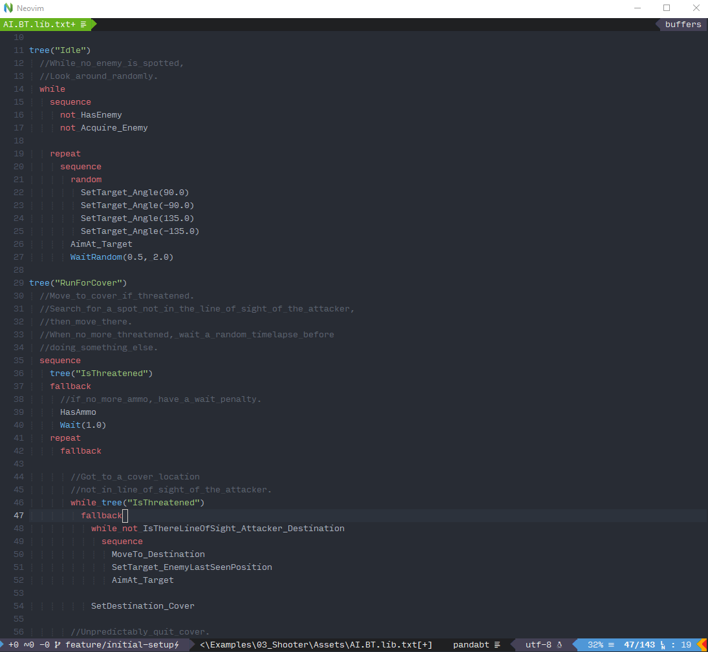

# vim-panda-bt
### Syntax highlight plugin made for [Panda BT](http://www.pandabehaviour.com) - a [Unity3D](https://unity.com) plugin for scripting Behaviour.

This plugin uses a indent based custom scripting language to create beahviour trees. Since these scripts were plain text files, it was difficult to understand the script without proper syntax higlighting.So I created this plugin to address the issue.

**Note that**, there is inbuilt syntax highlighting provided with the plugin which only works inside the Unity3D editor.


### Install via [vim-plug](https://github.com/junegunn/vim-plug)

Add to vimrc:
```vim
Plug 'gautamnaik1994/vim-panda-bt'
```

### Requirements

For the plugin to work properly, you will need to add **.BT.txt** as your file extension while creating new Panda Behaviour Tree file.

### Usage
Add the following line to your .vimrc or init.vim
```vim
au BufNewFile,BufRead *.BT.txt,*.BT.lib.txt set ft=pandabt
```

## Screenshots
<caption>Vim Default Dark Theme</caption>



<caption>Onedark Theme</caption>



## Acknowledgements

A huge thanks goes to Eric Begue for creating [Panda BT](http://www.pandabehaviour.com)
